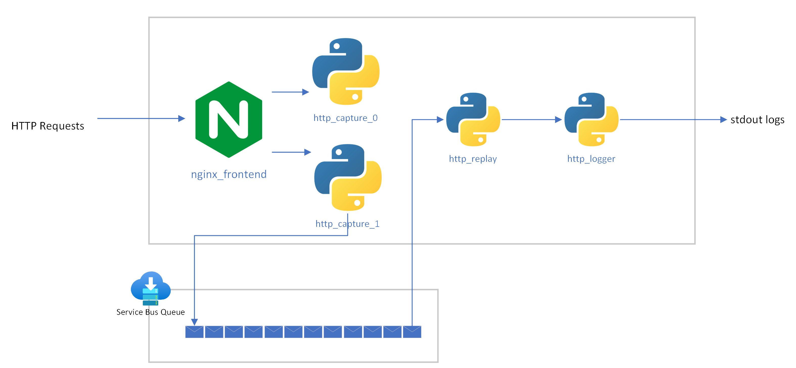

# HTTP Data Saver

This is a proof-of-concept to illustrate the use of a Azure Service Bus queue and a series of Python processes to ensure HTTP data capture is uninterrupted. This is to ensure that important data sent via HTTP is preserved in the case of the the intended endpoint being unavailable. This is not intended for production use.

## Quickstart
After downloading or cloning this repo follow these steps:
- Set the the following environment variables in the `.env` files for http_capture, http_replay and http_logger:
    * `SERVICE_BUS_NAMESPACE_CONNECTION_STRING`: This is your connection string for your Service Bus endpoint. The string will be of the following form: `Endpoint=sb://<INSTANCE_NAME>.servicebus.windows.net/;SharedAccessKeyName=RootManageSharedAccessKey;SharedAccessKey=<YOUR_SECRET>`
    * `SERVICE_BUS_QUEUE_NAME`: The name of your queue. 
    * `DOWNSTREAM_ENDPOINT`: (only needed for http_replay) The server to send the queued request to. Takes the form of `http://localhost:5000`.
- Build all the containers needed by running `docker-compose build`.
- Run the stack by running `docker-compose up`
- Send a request `curl -X GET http://localhost:8080/blah` and watch it pass through.

## Requirements
- A Azure Service Bus queue accessible from where you will be running this stack.
- Docker and Docker Compose

## Components Overview

The application flow takes place from left to right. Each of the components has the following function:
- **nginx_frontend**: Serves as a primitive load balancer. In a real world scenario this component would be replaced with a managed load balancer.
- **http_capture**: This process captures any http request and stores headers, body and method on service bus.
- **http_replay**: This process listens to the queue, recovers the requests and sends them to the `DOWNSTREAM_ENDPOINT`.
- **http_logger**: This process logs all incoming request to standard out. In a real world scenario this would be replaced by the intended endpoint.

## Limitations and Todo

- All incoming requests are responded via a status code 200. Endpoint responses are never fed back to the original sender.
- http_replay logging is currently delayed. It is hence advised to wait a few minutes for logging to show up.